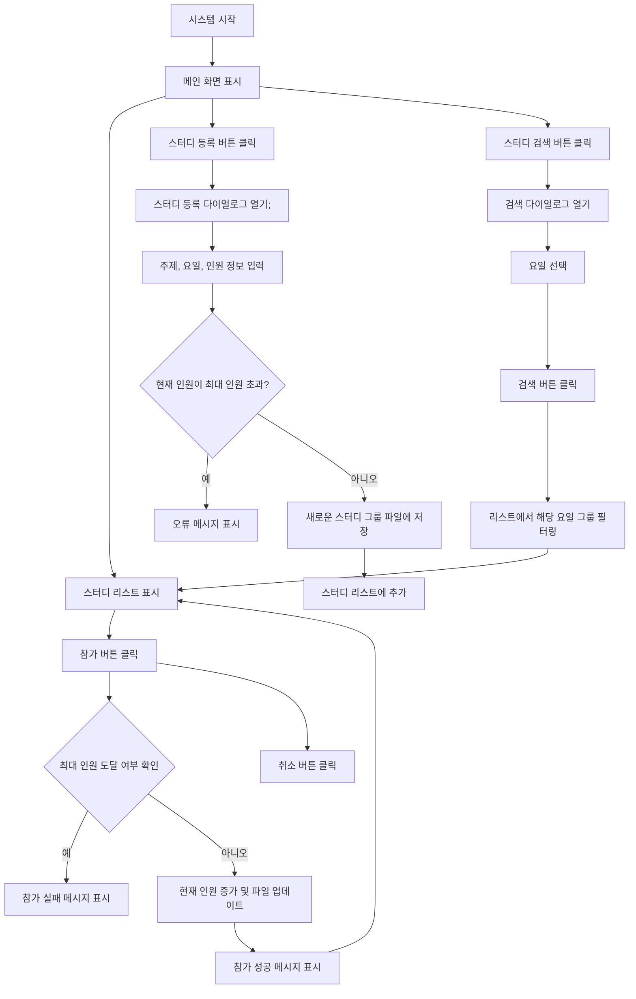

# StudyGruop Matching

## 목차
1. [개요](#개요)
    1. [목적](#1-목적)
    2. [대상](#2-대상)
   

2. [프로그램의 중요성 및 필요성](#프로그램의-중요성-및-필요성) 
    1. [중요성](#1-중요성)
    2. [필요성](#2-필요성)

3. [프로그램 수행 절차](#프로그램-수행-절차)
    1. [다이어그램](#1-다이어그램)
    2. [클래스 다이어그램](#2-클래스-다이어그램)
    3. [절차 설명](#3-절차-설명)

4. [느낀점](#느낀점)
   1. [느낀점](#1-느낀점)

## 개요
### 1. 목적
스터디그룹을 **등록 및 검색**하여 원하는 스터디 그룹에 **참가**하고, 인원을 **모집**할 수 있는 프로그램입니다.    
사용자들이 스터디 그룹을 쉽게 등록하고, 검색하며 참가할 수 있도록 돕기 위해 설계되었습니다.        
편하고 직관적인 UI를 제공함으로써 스터디 관리의 편리성을 극대화하는 것을 목표로 합니다.    
이 프로그램을 통해 스터디 그룹 활동을 활발하게 하여 **많은 사람들과의 교류 및 학습역량 발전**을 목표로합니다.

### 2. 대상
기본적으로 스터디 그룹에 관심있는 **청주대 학생들**을 대상으로합니다.  
&nbsp;&nbsp;&nbsp;&nbsp;&nbsp;&nbsp; ● 학습이나 프로젝트를 위한 그룹 활동을 계획중인 학생  
&nbsp;&nbsp;&nbsp;&nbsp;&nbsp;&nbsp; ● 특정 요일에 맞는 스터디를 가입하고자 하는 학생

---

## 프로그램의 중요성 및 필요성
### 1. 중요성  
&nbsp;&nbsp;&nbsp;&nbsp;&nbsp;&nbsp; ● 효율적인 생성 및 참가 : 복잡성을 줄이고, 그룹 생성 및 참여 과정을 간소화합니다.   
&nbsp;&nbsp;&nbsp;&nbsp;&nbsp;&nbsp; ● 시간 절약 : 등록된 스터디 그룹 정보를 한눈에 파악하고, 검색 기능을 통해 원하는 요일의 스터디 그룹을 빠르게 찾을수 있습니다.      
&nbsp;&nbsp;&nbsp;&nbsp;&nbsp;&nbsp; ● 사용자 친화적 : 직관적인 UI와 명확한 동작 흐름을 제공하여 쉽게 사용하는 것을 목표 개발하였습니다.

### 2. 필요성
&nbsp;&nbsp;&nbsp;&nbsp;&nbsp;&nbsp; ● 

---

## 프로그램 수행 절차
### 1. 다이어그램

### 2. 클래스 다이어그램

### 3. 절차 설명

---

## 느낀점
### 1. 느낀점
