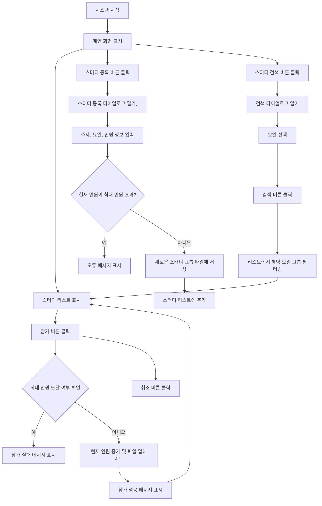
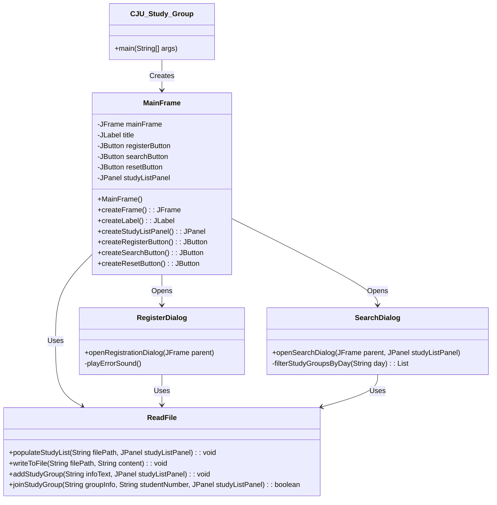
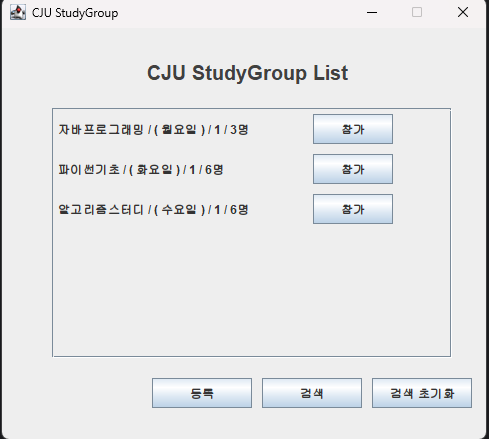
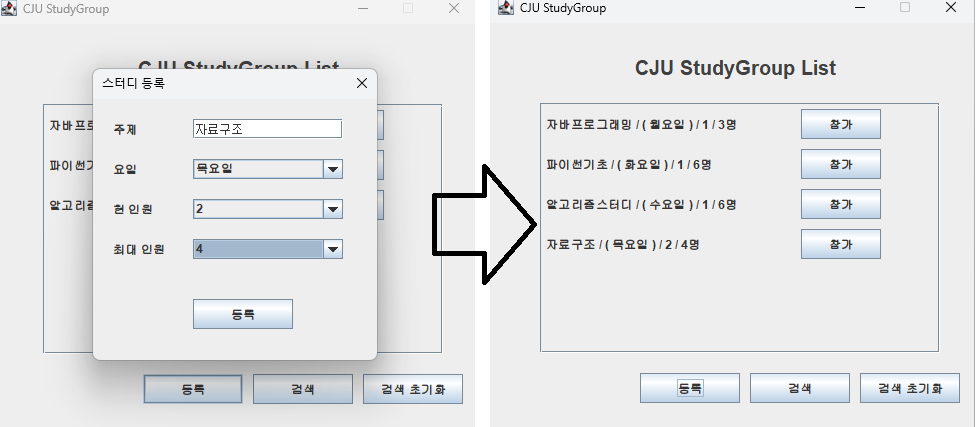
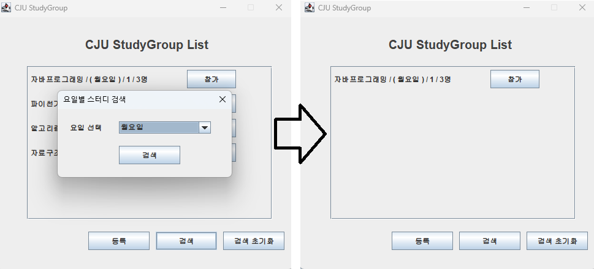
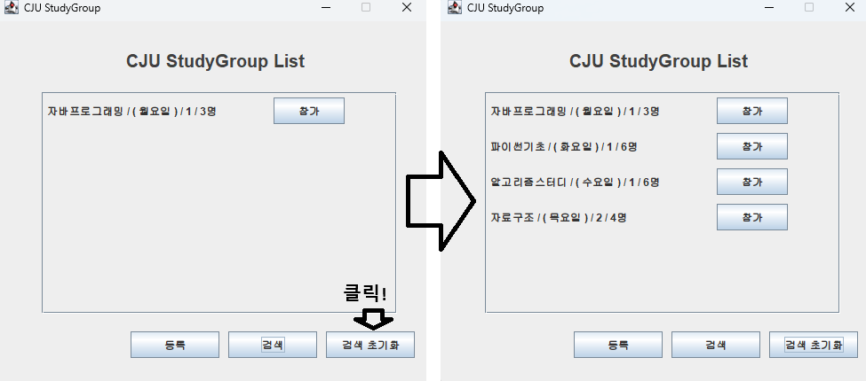
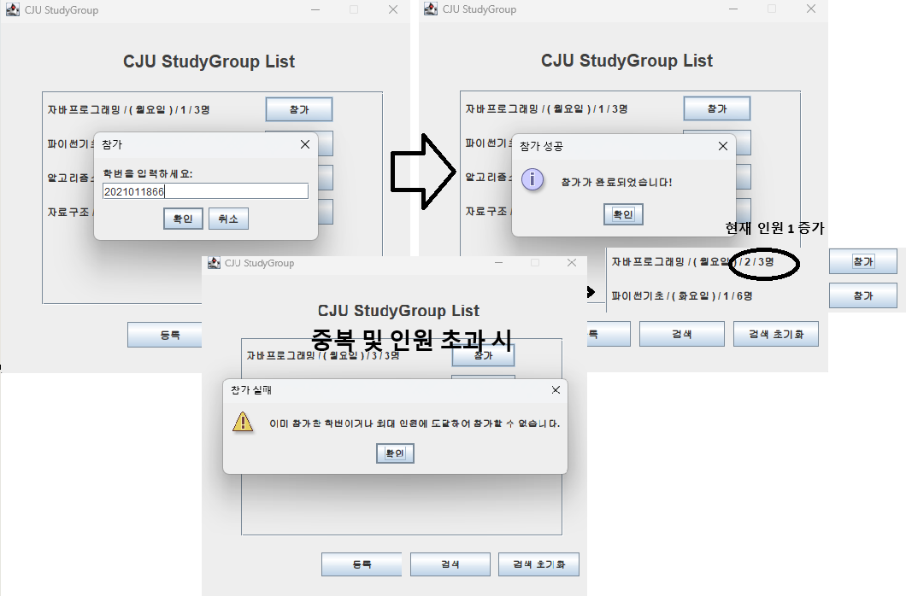

# StudyGruop Matching

## 목차
1. [개요](#개요)
    1. [목적](#1-목적)
    2. [대상](#2-대상)
    3. [주제선정이유](#-3-주제-선정이유)
   

2. [프로그램의 중요성 및 필요성](#프로그램의-중요성-및-필요성) 
    1. [중요성](#1-중요성)
    2. [필요성](#2-필요성)

3. [프로그램 수행 절차](#프로그램-수행-절차)
    1. [다이어그램](#1-다이어그램)
    2. [클래스 다이어그램](#2-클래스-다이어그램)
    3. [절차 설명](#3-절차-설명)

4. [프로그램 실행 화면](#프로그램-실행-화면)

5. [추후 개발 계획](#추후-개발-계획)

5. [느낀점](#느낀점)

## 개요
### 1. 목적
스터디그룹을 **등록 및 검색**하여 원하는 스터디 그룹에 **참가**하고, 인원을 **모집**할 수 있는 프로그램입니다.    
사용자들이 스터디 그룹을 쉽게 등록하고, 검색하며 참가할 수 있도록 돕기 위해 설계되었습니다.        
편하고 직관적인 UI를 제공함으로써 스터디 관리의 편리성을 극대화하는 것을 목표로 합니다.    
이 프로그램을 통해 스터디 그룹 활동을 활발하게 하여 **많은 사람들과의 교류 및 학습역량 발전**을 목표로합니다.

### 2. 대상
기본적으로 스터디 그룹에 관심있는 **청주대 학생들**을 대상으로합니다.  
&nbsp;&nbsp;&nbsp;&nbsp;&nbsp;&nbsp; ● 학습이나 프로젝트를 위한 그룹 활동을 계획중인 학생  
&nbsp;&nbsp;&nbsp;&nbsp;&nbsp;&nbsp; ● 특정 요일에 맞는 스터디를 가입하고자 하는 학생

### 3. 주제 선정이유   
학교에는 여러 친구들과 교류 하는 학생들도 많은 반면, 혼자 학교생활을 하는 사람들도 있습니다.
이러한 사람들도 다양한 정보를 얻고 교류할 수 있는 장을 보다 쉽게 접근할 수 있다면 학습역량을 길러 나가는데 도움이 되지 않을까 생각했습니다.  
이러한 사람 뿐만 아니라 자신이 부족한 점을 그룹 활동을 통해 찾아 개선해 나갈 수 있는 활동을 보다 쉽게 접근할 수 있도록 돕기 위해 주제로 선정했습니다.

---

## 프로그램의 중요성 및 필요성
### 1. 중요성  
&nbsp;&nbsp;&nbsp;&nbsp;&nbsp;&nbsp; ● 효율적인 생성 및 참가 : 복잡성을 줄이고, 그룹 생성 및 참여 과정을 간소화합니다.   
&nbsp;&nbsp;&nbsp;&nbsp;&nbsp;&nbsp; ● 시간 절약 : 등록된 스터디 그룹 정보를 한눈에 파악하고, 검색 기능을 통해 원하는 요일의 스터디 그룹을 빠르게 찾을수 있습니다.      
&nbsp;&nbsp;&nbsp;&nbsp;&nbsp;&nbsp; ● 사용자 친화적 : 직관적인 UI와 명확한 동작 흐름을 제공하여 쉽게 사용하는 것을 목표 개발하였습니다.

### 2. 필요성
이 프로그램은 학습을 효율적으로 할 수 있도록 도와주는 스터디 그룹 매칭 프로그램입니다.  
스터디 그룹을 쉽게 찾아보고, 참여할 수 있도록 돕습니다.  
기존에는 스터디 그룹을 찾고, 정보를 주고받기 위해 많은 시간을 소모하거나, 참여 인원을 찾는데 어려움을 겪을 수 있었습니다.  
이 프로그램은 이러한 문제점을 해결하고, 사용자에게 보다 편리한 경험을 제공하기 위해 개발되었습니다.

---

## 프로그램 수행 절차
### 1. 다이어그램

### 2. 클래스 다이어그램

### 3. 절차 설명
#### 1.  프로그램 실행 (CJU_Study_Group 클래스)    
   main() 메소드를 실행하여 `CJU_Study_Group` 객체를 생성합니다.      
   `CJU_Study_Group` 객체는 MainFrame을 생성하여 전체 UI 화면을 표시합니다.

#### 2. 메인 프레임(MainFrame 클래스)   
   `MainFrame` 클래스는 전체 UI 화면을 설정하며, JFrame으로 화면을 구성합니다.  
   `title`, `registerButton`, `searchButton`, `resetButton`과 같은 UI 컴포넌트를 설정합니다.  
   `studyListPanel`은 스터디 그룹 목록을 표시하는 패널로, 이를 설정하고 화면에 추가합니다.  
   `createFrame()`, `createLabel()`, `createRegisterButton()`, `createSearchButton()`, `createResetButton()` 메서드를 통해 UI 요소를 초기화합니다.

#### 3. 스터디 그룹 등록 (RegisterDialog 클래스)
   사용자가 등록 버튼을 클릭하면 `RegisterDialog.openRegistrationDialog()`가 호출됩니다.   
   `RegisterDialog`는 주제, 요일, 현재 인원, 최대 인원 등의 정보를 입력받는 화면을 표시합니다.  
   사용자가 입력한 정보는 유효성 검사를 거친 후 `ReadFile.writeToFile()` 메서드를 통해 파일에 저장됩니다.  
   등록된 스터디 그룹 정보는 `MainFrame`의 `studyListPanel`에 추가되어 화면에 반영됩니다.  

#### 4. 스터디 그룹 검색 (SearchDialog 클래스)
   사용자가 검색 버튼을 클릭하면 `SearchDialog.openSearchDialog()`가 호출됩니다.  
   `SearchDialog`는 요일을 선택하여 해당 요일에 맞는 스터디 그룹을 검색합니다.  
   검색된 스터디 그룹 목록은 `studyListPanel`에 표시되며, 화면이 갱신됩니다.  
   `ReadFile.filterStudyGroupsByDay()` 메서드를 통해 파일에서 해당 요일의 스터디 그룹을 필터링합니다.  

#### 5. 스터디 그룹 참가 (ReadFile 클래스)
   사용자가 스터디 그룹의 참가 버튼을 클릭하면, `ReadFile.addStudyGroup()` 메서드가 호출됩니다.  
   참가하려는 학번을 입력받고, 입력된 학번이 이미 참가한 학번인지 확인합니다.  
   학번이 중복되지 않으면 참가가 승인되고, `ReadFile.joinStudyGroup()`을 통해 스터디 그룹 정보가 업데이트됩니다.  
   업데이트된 스터디 그룹 정보는 다시 화면에 표시됩니다.  

#### 6. 데이터 파일 관리 (ReadFile 클래스)
   `ReadFile` 클래스는 스터디 그룹 데이터를 파일에서 읽어오고 저장하는 기능을 담당합니다.  
   `populateStudyList()` 메서드는 파일에서 스터디 그룹 데이터를 읽어 `studyListPanel`에 추가합니다.  
   `writeToFile()` 메서드는 새로운 스터디 그룹 정보를 파일에 저장합니다.  
   `joinStudyGroup()` 메서드는 참가한 학번을 그룹 정보에 반영하여 파일에 업데이트합니다.  

#### 7. 오류 처리 및 사용자 경험 향상
   프로그램에서 중요한 오류 발생 시, 예외 처리와 사용자에게 오류 메시지를 제공합니다.  
   `playErrorSound()` 메서드는 오류 발생 시 효과음을 통해 사용자에게 알립니다.   
   사용자가 잘못된 입력을 할 경우, `JOptionPane.showMessageDialog()`를 사용하여 오류 메시지를 띄웁니다.  

---

## 프로그램 실행 화면

|           | 이미지                                |
|-----------|------------------------------------|
| 메인프레임     |       |
| 등록 창 및 결과 |   |
| 검색 화면     |     |
| 검색 초기화    |  |
| 참가 화면     |       |

---

## 추후 개발 계획  

&nbsp;&nbsp;&nbsp;&nbsp;&nbsp;&nbsp; ● 삭제 기능 구현  
&nbsp;&nbsp;&nbsp;&nbsp;&nbsp;&nbsp; ● 참가 후 그룹 장과 연락할 수 있는 방법 구현 (ex)대화방을 만든다던지, 오픈카톡 링크를 제공한다던지 등의 방법론)
&nbsp;&nbsp;&nbsp;&nbsp;&nbsp;&nbsp; ● 리스트 정보에 시간 대, 장소 등 추가 후 검색 기능에도 똑같이 추가

## 느낀점

&nbsp;&nbsp;&nbsp;&nbsp;&nbsp;&nbsp; ● 파일 처리의 어려움  
스터디 그룹의 정보를 파일에서 읽고, 쓸 때 발생할 수 있는 어려 오류들을 다루는 과정에서 많은 학습이 있었습니다.  
특히 파일을 읽어오고 수정하는 부분에서 발생할 수 있는 예외 처리 및 오류 처리의 중요성을 실감했습니다

&nbsp;&nbsp;&nbsp;&nbsp;&nbsp;&nbsp; ● 프로젝트 완성도 향상  
클래스 단위로 나누어 각 기능을 구현해보는 첫 번째 경험이였습니다.  
코드의 구조를 명확하게 분리하여, 기능 확장 등이 용이했습니다.  

&nbsp;&nbsp;&nbsp;&nbsp;&nbsp;&nbsp; ● 아쉬운 점  
프로그램을 만들 때 중요하게 생각하는 점이 Ui를 비롯하여 각종 기능들이 사용자에게 편리하게 적용될 수 있는 지에 대한 점이였습니다.  
하지만 이번 프로그램을 만들때는 혼자 개발하기도 했고, 실제 사용자가 없었기 때문에 혼자만의 생각으로 보완하고 수정했습니다.  
실제 사용자로부터 피드백을 받아 보완점을 찾고, 이를 개선하는 과정이 중요하다 라는 것을 간접적으로 느끼게 되었습니다.

